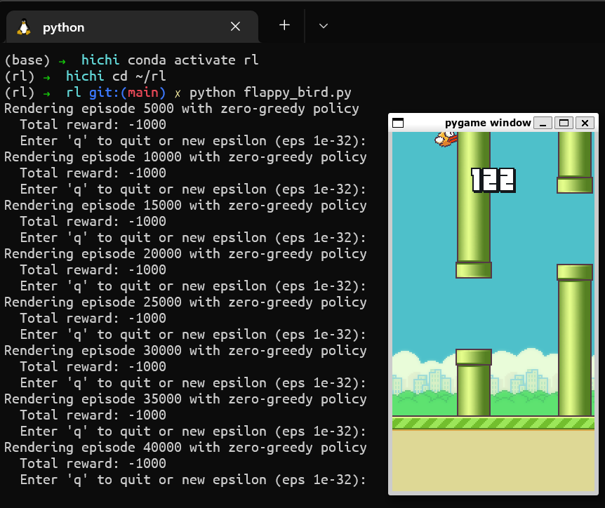

# Fun-with-Reinforcement-Learning

Just some draft/quick code while fuzzling around with OpenAI's gym environments.

The folder `rl` is structured like a Python module which allows easy importing learning algorithms, being `mdp` for finite deterministic Markov Decision Process (MDP) and `q_learning` for finite state and action space Q-learning.

Currently there are implementations of the following environments:
- Taxi-V3 ([https://www.gymlibrary.ml/environments/toy_text/taxi/])
- Flappy Bird ([https://github.com/Talendar/flappy-bird-gym])

